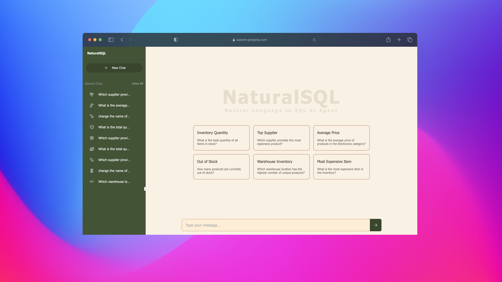
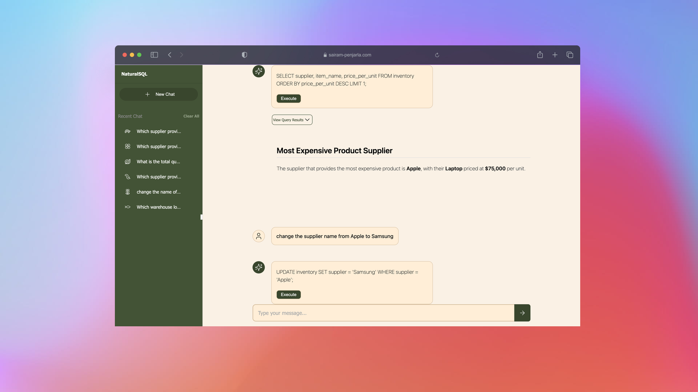
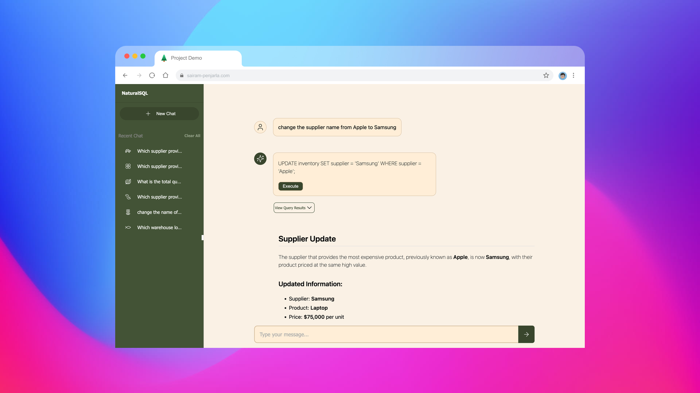

# [](https://psairam9301.wixsite.com/website) [](https://www.youtube.com/@sairampenjarla) [](https://github.com/sairam-penjarla) [](https://www.linkedin.com/in/sairam-penjarla-b5041b121/) [](https://www.instagram.com/sairam.ipynb/)

# SQL AI Agent

## 🚀 Project Overview
This project is an AI-powered chatbot that assists users in interacting with an SQL database using natural language. The goal is to allow users to write requests in plain English, and the AI agent will generate the corresponding SQL queries. Users can then review, modify, and execute the queries, making database operations more intuitive and accessible.

### Key Features:
- Converts natural language queries into SQL queries.
- Allows users to edit generated queries before execution.
- Supports SQL operations like data retrieval, updates, view creation, and stored procedures.
- Six predefined sample questions available on the welcome screen.
- Smart prompt engineering ensures appropriate chatbot responses.
- Uses OpenAI, Flask, Python, and JavaScript.
- Includes a detailed logging system, structured repo, and config files.
- Provides a media folder containing architecture diagrams and UI screenshots.
- Utilizes OpenAI streaming for word-by-word chatbot responses.
- Saves chat history with session storage and an interactive sidebar.
- Sidebar includes individual session deletion and a "Clear All" option.
- Uses icons from [Lucide.dev](http://lucide.dev/) for aesthetics.

## 📥 Installation & Setup
Follow these steps to get started with the project:

### 1️⃣ Clone the Repository
```bash
git clone https://github.com/sairam-penjarla/nlp-to-sql-ai-agent.git
cd nlp-to-sql-ai-agent
```

### 2️⃣ Set Up a Virtual Environment
For detailed instructions, refer to this [Blog Post](https://sairampenjarla.notion.site/Environment-171d56a2fc2780dd9efcd4cef331fa2c).

#### Using Virtual Environment (venv)
```bash
python -m venv venv
source venv/bin/activate  # On Windows: venv\Scripts\activate
```

#### Using Anaconda
```bash
conda create --name sql-ai-agent python=3.9
conda activate sql-ai-agent
```

### 3️⃣ Install Dependencies
```bash
pip install -r requirements.txt
```

### 4️⃣ Set Up API Key
Create a `.env` file in the project root and add your OpenAI API key:
```
OPENAI_API_KEY=your_api_key_here
```

### 5️⃣ Run the Application
```bash
python app.py
```

## 📸 Screenshots

### Welcome Screen

This is the welcome screen showing the name of the app and six suggested questions to get started with.

### Generated Query

This shows the AI-generated query for a user question along with the execute button.

### Chatbot Response After Execution

This is the chatbot’s response after executing the generated SQL query.

### Updating a Record

Here, the user asked the AI agent to update the supplier name in the records from 'Apple' to 'Samsung'.

### Chatbot Response After Update

This shows the chatbot confirming that the supplier name has been successfully updated.

## 📖 Learn More
For a detailed explanation of the project, visit this [Blog Post](https://sairampenjarla.notion.site/NLP-to-SQL-AI-Chatbot-187d56a2fc2781aab916fc63638a71ba).

## 🔗 Useful Links
- **GitHub Repository**: [NLP to SQL AI Agent](https://github.com/sairam-penjarla/nlp-to-sql-ai-agent)
- **Website**: [Visit Here](https://psairam9301.wixsite.com/website)
- **YouTube**: [Subscribe](https://www.youtube.com/@sairampenjarla)
- **LinkedIn**: [Connect](https://www.linkedin.com/in/sairam-penjarla-b5041b121/)
- **Instagram**: [Follow](https://www.instagram.com/sairam.ipynb/)

